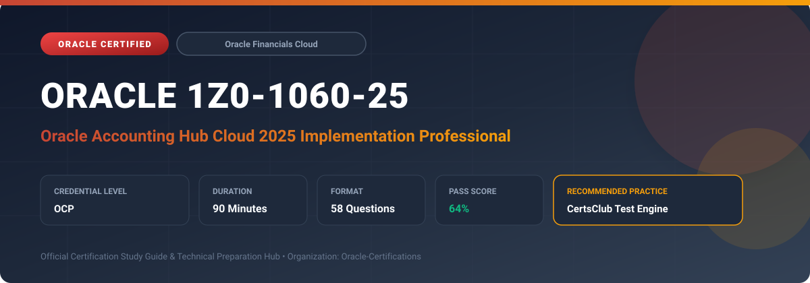

  

# Oracle 1Z0-1060-25: Oracle Accounting Hub Cloud 2025 Implementation Professional

---

## 1. Exam Overview & Candidate Profile

The **Oracle 1Z0-1060-25: Oracle Accounting Hub Cloud 2025 Implementation Professional** examination is designed for cloud professionals, enterprise architects, implementation consultants, and systems administrators who demonstrate deep practical knowledge and operational competence in deploying, configuring, and optimizing Oracle technologies.

The Oracle Accounting Hub Cloud 2025 Implementation Professional (1Z0-1060-25) certification demonstrates the candidate's expertise in configuring and implementing Oracle Accounting Hub Cloud. It validates skills in registering source systems, defining accounting event models, creating flexible rule-based accounting transformations, configuring subledger journal entry rule sets, managing supporting references, and balancing multi-GAAP accounting treatments.

### Target Audience & Prerequisites
- **Target Roles**: Implementation Consultants, Cloud Solution Architects, DevOps/SysOps Engineers, and Enterprise Functional Analysts.
- **Recommended Experience**: 1–2 years of hands-on experience in configuring, administering, or implementing the relevant Oracle solutions.
- **Credential Earned**: Oracle Certified Professional (OCP).

---

## 2. Key Exam Specifications

| Specification | Details |
| :--- | :--- |
| **Exam Code** | **Oracle 1Z0-1060-25** |
| **Official Title** | Oracle Accounting Hub Cloud 2025 Implementation Professional |
| **Certification Track** | Oracle Financials Cloud |
| **Exam Duration** | 90 Minutes |
| **Number of Questions** | 58 Questions |
| **Passing Score** | 64% |
| **Question Format** | Multiple Choice (Single/Multiple Answer), Scenario-Based Questions |
| **Delivery Provider** | Oracle University / Pearson VUE (Online Proctored or Test Center) |
| **Recommended Practice Engine** | [CertsClub Oracle Practice Tests](https://www.certsclub.com/oracle/1z0-1060-25-dumps.html) |

---

## 3. Official Blueprint & Exam Domain Breakdown

The examination assesses candidate competencies across core functional domains weighted as follows:

| Domain Area | Weighting |
| :--- | :--- |
| **Source System Registration & Data Ingestion** | `25%` |
| **Accounting Transformation Rules & Event Models** | `30%` |
| **Subledger Journal Entries & Supporting References** | `20%` |
| **Multi-GAAP & Multi-Currency Accounting Configurations** | `15%` |
| **Exception Processing, Audit, & Reporting** | `10%` |

---

## 4. Deep Dive into Complex & Challenging Technical Topics

To secure a passing score on the 1Z0-1060-25 exam, candidates must master the following advanced concepts:

- Configuring transaction objects and source system metadata upload templates to support high-volume legacy system ingestion.
- Designing advanced conditional accounting rules with custom mapping sets and account derivation rules across multiple ledgers.
- Tracking granular operational and transaction-level attributes using Supporting References with balances.
- Managing subledger accounting exceptions, diagnostic frameworks, and reconciling subledger entries with General Ledger.

---

## 5. Scenario-Based Demo & Practice Questions

### Question 1
When registering a new external source system in Oracle Accounting Hub Cloud, what must be defined first to establish the structure of transactional data?

A) Account Derivation Rules
B) Transaction Type and Header/Line Event Model
C) Mapping Set Values
D) Journal Entry Rule Set

- **Correct Answer**: `B) Transaction Type and Header/Line Event Model`
- **Technical Explanation**: Source system registration starts with defining the event model, which includes the event class, event types, and transactional header and line attribute structures before accounting rules can be mapped.

---

### Question 2
Which feature in Oracle Accounting Hub Cloud enables tracking of non-accounting attributes (such as customer number or project code) without creating additional segments in the Chart of Accounts?

A) Descriptive Flexfields (DFF)
B) Supporting References with or without balances
C) Secondary Ledgers
D) Statistical Currency Units

- **Correct Answer**: `B) Supporting References with or without balances`
- **Technical Explanation**: Supporting References allow organizations to capture transaction details and store operational metrics at the subledger journal line level, optionally maintaining running balances without impacting Chart of Accounts segment limits.

---

## 6. Recommended Preparation Strategy & Practice Testing Engine

Achieving certification in **Oracle 1Z0-1060-25** requires balanced theoretical study and scenario-based simulation practice:

1. **Review Oracle Documentation**: Master architecture guides, implementation workbooks, and administration manuals on the Oracle Help Center.
2. **Hands-on Lab Practice**: Execute real-world configuration, policy setup, and troubleshooting tasks in your cloud tenancy or test instance.
3. **Simulated Exam Drills**: Practice answering timed, scenario-based multiple-choice questions to familiarize yourself with the question formats, traps, and timing constraints.

### Practice With CertsClub
For realistic practice questions, updated dumps, and mock testing environments:
- **Resource**: [CertsClub Oracle Practice Test Engine](https://www.certsclub.com/oracle/1z0-1060-25-dumps.html)
- **Special Discount**: Use coupon code **`club20`** during checkout for an instant **20% discount** on all practice exam bundles and testing engines.

---

## 7. Official Documentation & References

- [Oracle University Certification Registry](https://education.oracle.com/)
- [Oracle Help Center Documentation Portal](https://docs.oracle.com/)
- [Oracle Cloud Infrastructure & Applications Guides](https://docs.oracle.com/en/cloud/)
- [CertsClub Oracle Certification Exam Practice](https://www.certsclub.com/oracle/1z0-1060-25-dumps.html)

---

## 8. SEO & Discovery Keywords

`oracle 1z0-1060-25`, `oracle 1z0-1060-25 exam`, `oracle 1z0-1060-25 dumps`, `1Z0-1060-25 practice questions`, `1Z0-1060-25 study guide`, `oracle 1z0-1060-25 syllabus`, `oracle accounting hub cloud 2025 implementation professional`, `certsclub 1z0-1060-25`